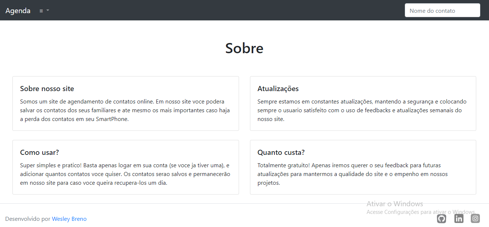

<h1 align="center">Agenda de contatos</h1>

Clique aqui para acessar o <a href="https://web-production-97cd.up.railway.app/sobre/">projeto</a>.

<h2 align="center">Resumo</h2>

  Projeto de uma agenda de contatos utilizando o framework Django. Na agenda, é possível registrar informações como nome, sobrenome, número de telefone e descrição do contato. Além disso, foi implementada a funcionalidade de cadastro e login, permitindo que o usuário adicione seus contatos de maneira segura e possa recuperá-los caso haja perda dos dados em seu smartphone.

<h2 align="center">Funcionalidades</h2>

  <h3>Principais</h3>
  <li>Adicionar contato
  <li>Atualizar contato
  <li>Pesquisar contato
  <li>Resumo dos contatos na tela inicial
  <li>Cadastro/Login/Logout
  <li>Pagina sobre o site
    
  <h3>Contato</h3>
  <li>Escrever resumo do contato
  <li>Adicionar numero do contato
  <li>Atualizar contato
  <li>Adicionar categoria do contato
  <li>Data de criação do contato

<h2 align="center">Tecnologias usadas</h2>

  
  

